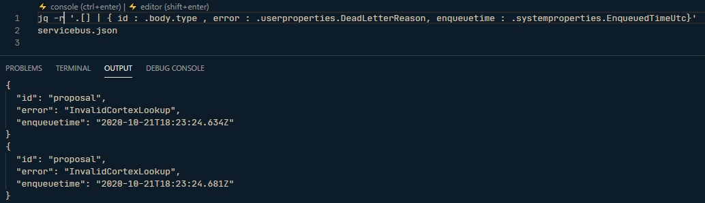

# busdriver

[Service Bus Explorer](https://github.com/paolosalvatori/ServiceBusExplorer) is a great tool but makes messages browsing tedious and hard to compare.

`busdriver` is intended to dump Service Bus queues & subscriptions with **JSON** payloads with minimal effort and fast re-run thanks to flexible profiles configuration.

`busdriver` works great in conjunction with [JQ](https://stedolan.github.io/jq/). And even greater with IDE extension such [Visual Studio Code JQ playground](https://marketplace.visualstudio.com/items?itemName=davidnussio.vscode-jq-playground) on top of ``busdriver` output.



## configuration
`appsettings.json`

```
{
  "environments": {
    "test": "Endpoint=sb://xxxxxxxx.servicebus.windows.net/;SharedAccessKeyName=xxxxxxx;SharedAccessKey=xxxxxx",
    "dev": "Endpoint=sb://xxxxxxxx.servicebus.windows.net/;SharedAccessKeyName=xxxxxxx;SharedAccessKey=xxxxxx",
    "sandbox" : "xxxx"
  },
  "profile" :  "deadletteremp", // active profile if no profile name provided as in command line parameter
  "profiles": {
    "deadletteremp": {
      "environment": "production", // reference to environments
      "topicname": "employee", // topic name [optional if browsing a queue]
      "receivername": "employeesubscription", // queue or subscrption name
      "deadletter": true, // false : active, true : deadletter [optional, default = active]
      "filters": {
        "body": {}, // filter on json body properties
        "userproperties": {}, // filter on json user properties
        "systemproperties": {} // filter on json system properties
      },
      "outputfilename" :  "employee.json" // [optional] if not provided, messages would be dump to console output stream.
    }
  }
}
```